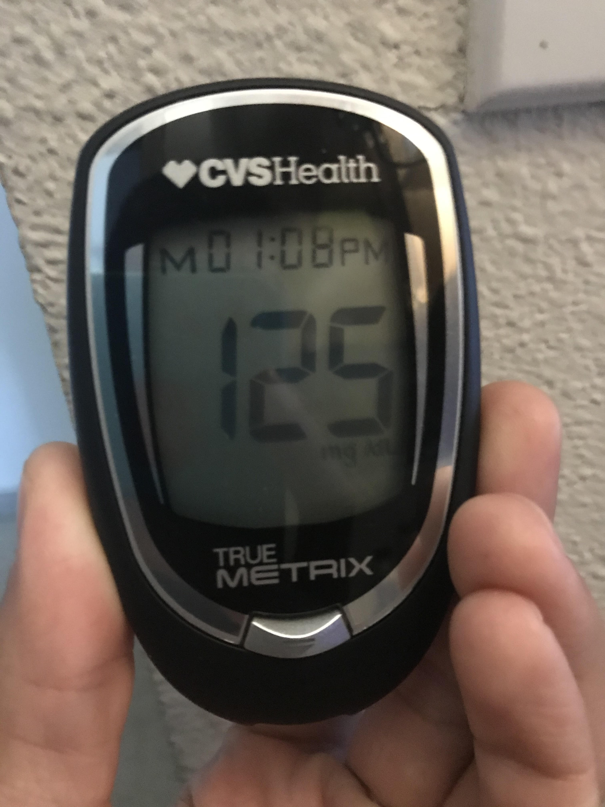
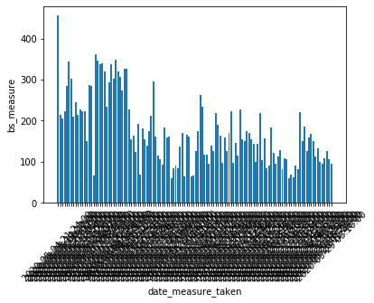

# Diabetes Data Tracking Project
---------------------------------------------------

Hello and welcome to my Diabetes Data Tracking project!

In May I was diagnosed with Type 1 Diabetes which meant I had to start keeping close track of what I was eating and my blood glucose levels. I got a whole starting kit upon arriving to CVS after the doctor's office, including this 'True Metrix' blood sugar monitor.

The extent of analytics that this monitor can do is show me averages for the week and month.

The time is also 67 minutes off.

The monitor came with a pocket sized piece of graph paper that had a few rows for the times during the day I checked my levels. There are also other monitors out there on the market that hook up to an app on your phone but neither of these ways seemed like the way I wanted to approach this. 

I was (and still am) working on my SQL skills and had just [built a project](https://github.com/mctopherganesh/emotions_tracking) that allowed me to populate an SQL database using Python.

#### Progress

As of this writing ( June 08, 2020 ) I have decided on, and written a Discord bot as a means for data entry ( here is a video of it working and entering the data: https://www.youtube.com/watch?v=8Z6Zoao9YLI ) 

I also decided on Heroku for deploying the bot and after a failed deploy learned that Heroku uses Postgresql as their main database storage which means I'll have to reconfigure how my bot enters data. I have written in functionality to enter data about what food I'm eating as well so later on I might be able to look back and see what food affects my blood sugar the most.

The last functionality I wrote into the bot was to test if I could send pictures from one side of the app to the Discord chat interface. Which I was able to. This is the first picture I sent

This is my blood sugar data from the first test I did with my monitor the day I got home from the doctors office. There is still messy data in this graph but the overall trend is shown correctly. The shadow looking thing below the graph is actually the dates and times I took the measures all compressed together.

#### The project objectives 

- Challenge myself to build a data pipeline from scratch
- build upon current ability in SQL
- create a simple tool that I can use to reference data about my health with a few simple commands 

#### Tools I'm using

- Python 
	+ pandas
	+ matplotlib
	+ sqlite3
	+ discord
- SQL
- Discord
- Jupyter Notebooks
- Postgresql

#### Things I've learned
 
- How to do SQL in Jupyter Notebooks and it comes with it's own graphing functions
- that VS Code is awesome sauce
- that you shouldn't wait to record hundreds of data points
